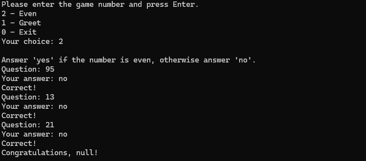
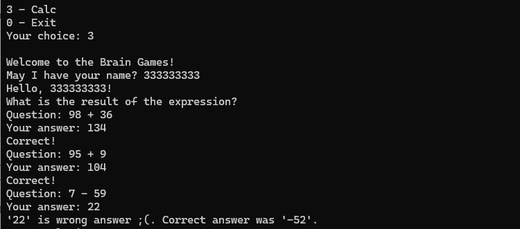
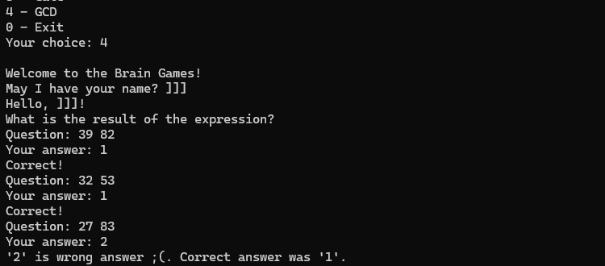
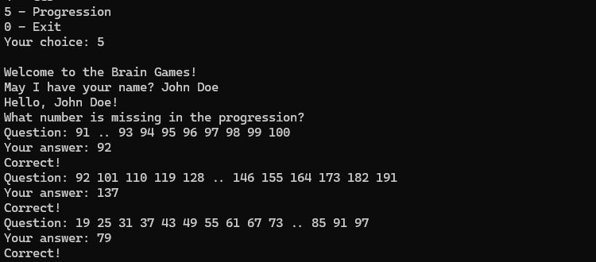
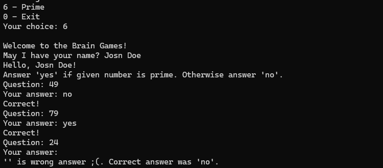

### Hexlet tests and linter status:
[](https://github.com/ArtMan-8/java-project-61/actions) [](https://codeclimate.com/github/ArtMan-8/java-project-61/maintainability)

<hr />

# Игры разума

Консольное приложение с набором простых игр.
После начала игры, следуй подсказкам на экране.

Запуск игры

```bash
make run-dist
```

#### Игра: "Проверка на чётность"


#### Игра: "Калькулятор"


#### Игра "НОД"


#### Игра "Арифметическая прогрессия"


#### Игра "Простое ли число?"

